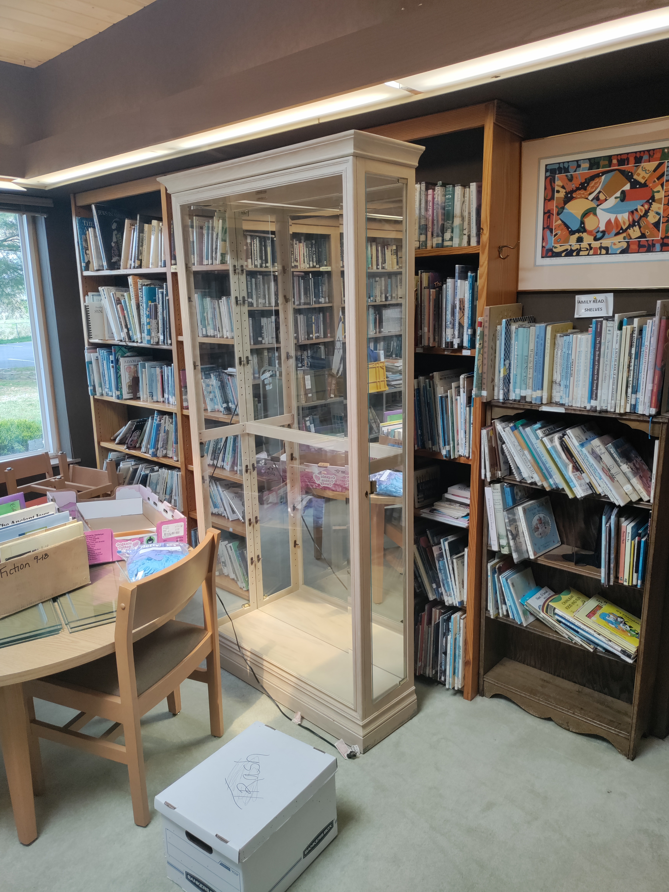
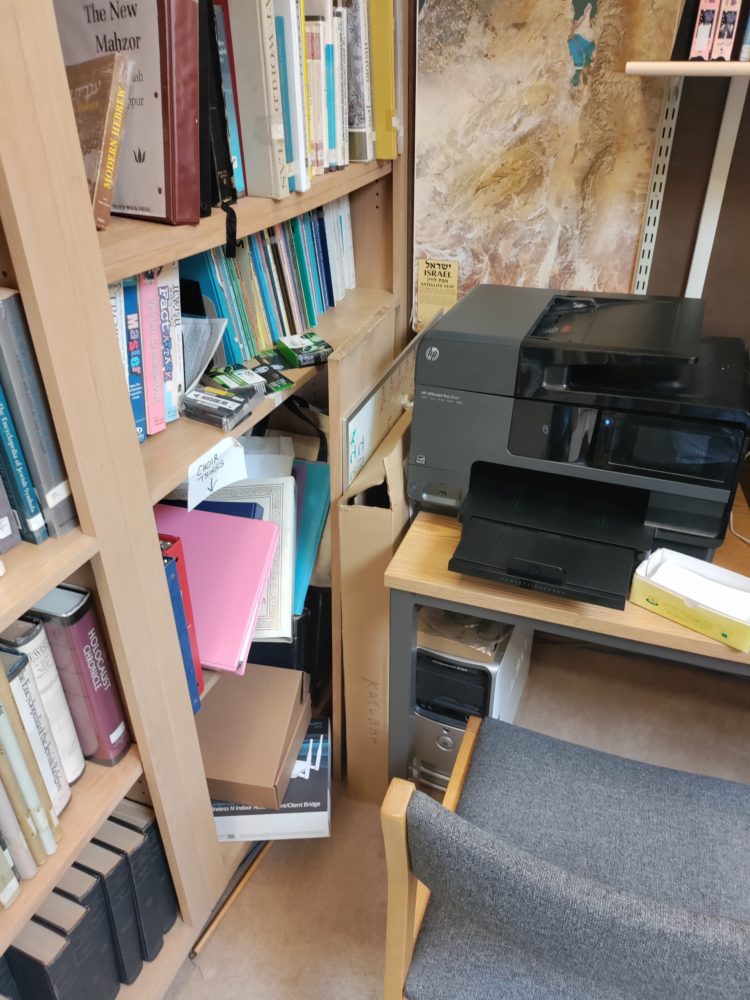
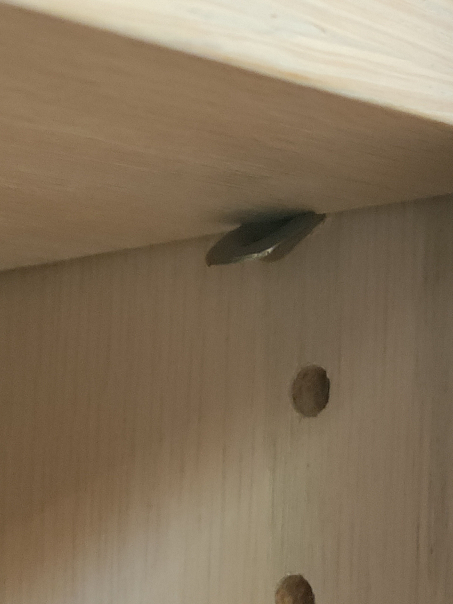
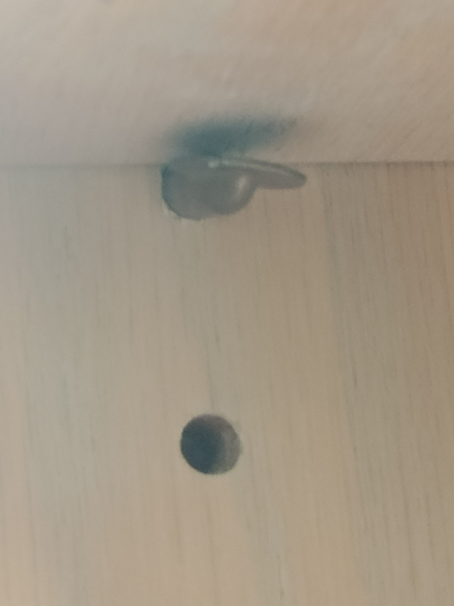
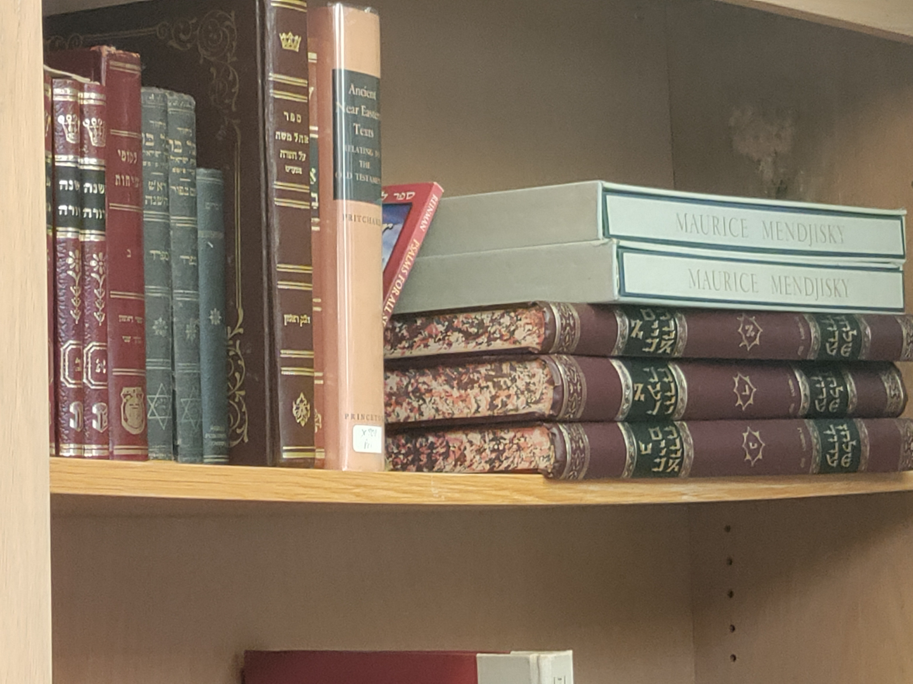
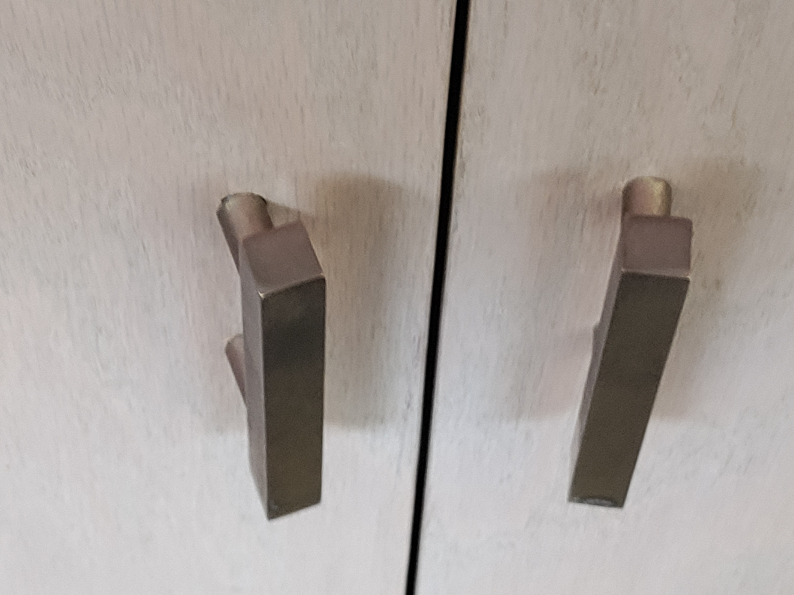
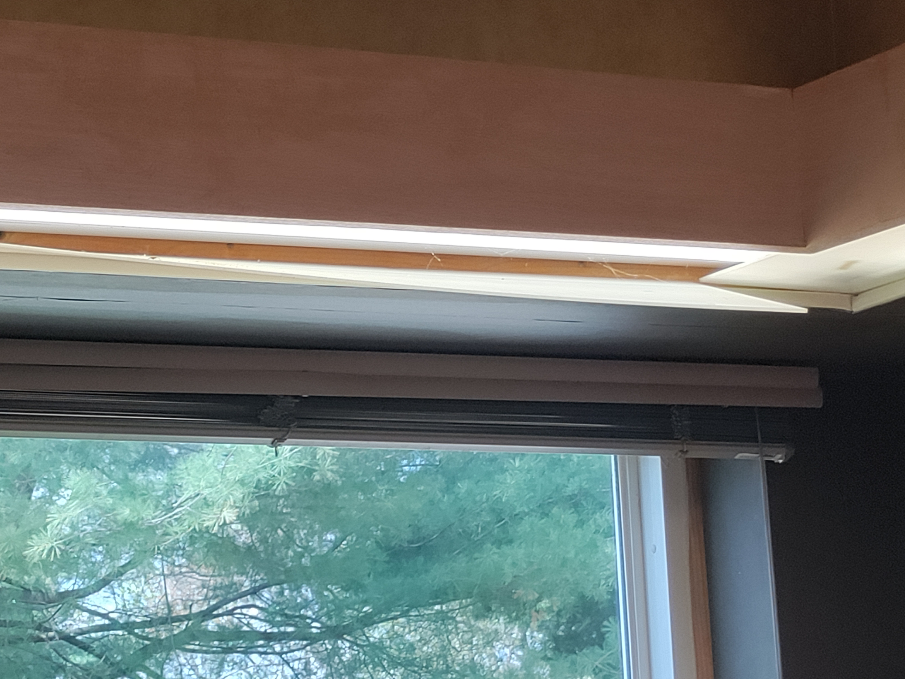

# Rich's Temple Sinai Library Pictures, April 18, 2021

I went to the library before I did mandolin duty with the Chew Crew.

## General Notes About the Collection

I started my visit by counting the shelves. Not including cabinet
shelving, there are 86 book shelves. With an estimate of 40 books per
shelf, that gives us 3440 books or items on the shelves.  A good many
of that 3440 are classified with Dewey call numbers and have plastic
book covers.  There are another few hundred in boxes and on trucks.
So I would guess somewhere between 4,000 and 5,000 books/items possibly
up to 6,000 if there are caches I haven't accounted for or if I didn't
account for some smaller sections of small media items.

Most of the shelves are full. The more over 75% capacity the shelves are
the more difficult it becomes to maintain a collection &mdash; allowing
for budgeted collection development (including changes in media), gift
processing, weeding, and shifting.

With the library's current configuration, about 860 books will need to
get weeded from the shelves to make the collection manageable.

Unless additional space is procured, any reconfiguration will involve
weeding considerably more than 860 books.

## The Pictures

I started capturing things that caught my eye.

----

### It's Gotta Go!

We have to get this glass display case out! 

----

### Clutter!

There are clutter problems. Hard to manage without storage space. Another
room?

----

### Computer Area Out of Date

The computer area is very congested. John
tells me it gets pretty frequent use, so
it might be worth investing in some furniture
dedicated to computer use. We should be able 
to get a feel for demand from the survey.

New mini computers would also be easier
to work with than old desktop towers.
Combining these with dedicated furniture
would make this area much more comfortable.

Oh! Are those machine even 64bit?!

----

## Shelving and Capacity

Some of the shelves are under stress, as
evidenced by visible warping and deformation
of the pins and their slots. John points
out the shelves can reinforced. 

I urge you to bear in mind my note about shelving
capacity and collection manageability. Keeping
the shelves as close to 75% capacity would help.

Do we have replacement pins?

<!--  -->

----

## Other Repairs, Details

- The room itself is in good shape. 
- The carpet needs replacing. 
- With the exception of the faded and deformed diffusers, the lighting is good. Some task lighting would be helpful. 
- The ceiling with its exposed lumber rafters is very pleasant.

----

## Do You Think the 1950s Air Force Issue Desk Needs to Go?

It's a workhorse but it should go out to pasture now.

&ndash; Rich, Tue 20 Apr 2021 02:11:38 PM EDT

